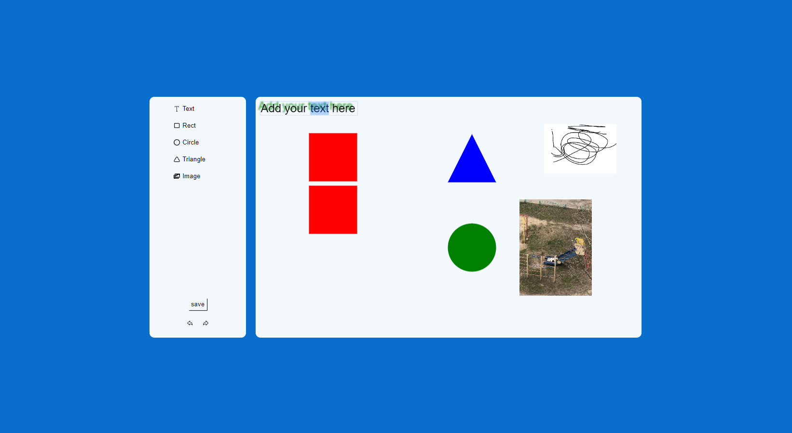

# Fabric.JS Canvas

Поле для добавления текста, различных svg фигур и изображений,на котором реализиованы кнопки reno undo, а также получения svg кода по кнопке save!
Доступна функция зума.

[Demo!](https://leva122434325.github.io/Fabricjs/)

## Dependency

"fabric": "^5.3.0",
"node-sass": "^9.0.0",
"react-icons": "^4.12.0",
